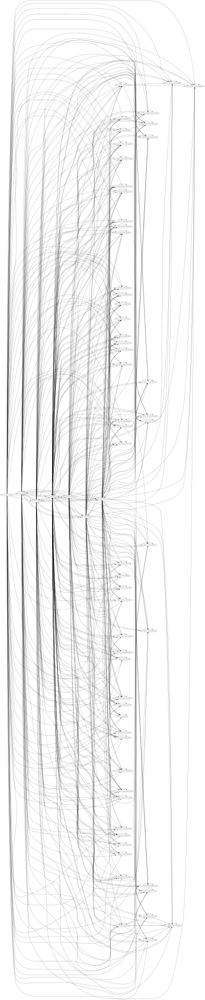

# web-graph

Generates a graph (using Graphviz) which shows the links between websites. Give it a URL to start
with, and it'll recursively go through all the links on that site, then the links on those sites,
and so on, until it either generates the specified amount of nodes or runs out of links.

To run it, you'll need to `dot` command available in your `$PATH` - look up _Graphviz_ to install
it. Run the program with:

```
go run main.go -nodes <max nodes> -depth <max depth> -url <the URL>
```

On the URL, remember to include the protocol, otherwise you'll get an error.

## Example
This is the output of running it on _https://golang.org_ with 64 nodes.

